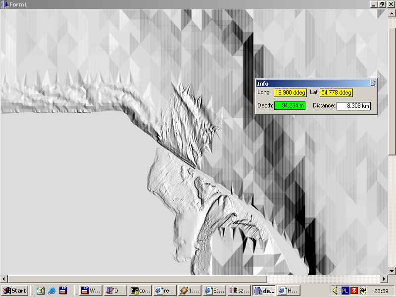
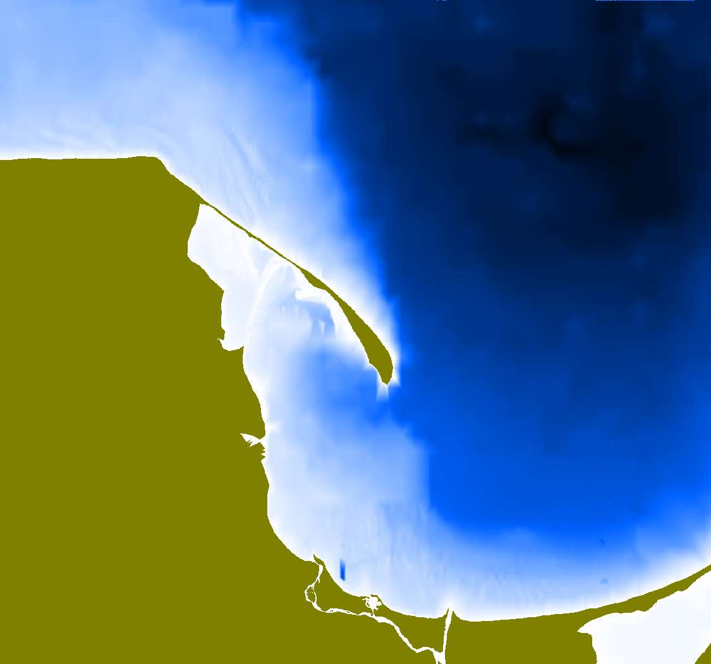

# paleo-depth

  Back in 1999 it wasn't many online DEM sources with resolution higher then 1 m, and one day I've found
  that Polish Institute of Oceanography made such data avaiable for limited part of Baltic waters (around Gulf of Gdansk).  
  
  This simple, 'paleo' code shows how informative is hill shading oposite to normal colour rendering. With hill shading you easy see feetures, data quality etc.  
  
  Hill shading :

   
  Normal colour render :

  
